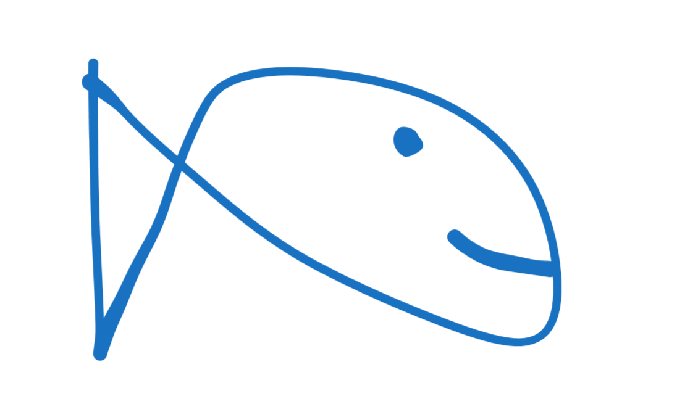

# pike
Nonchalant fishing poker game

### What is pike

Pike is an exiting fishing extravaganza that mixes poker and fishing into a
coherent experience that produces minutes of fun! This game is a simple-2D
fishing-like.

### What inspired pike

Pike was inspired by Balatro and WebFishing--a combination of strategy and
aesthetic.

### Build

Building for both Windows and Linux use the `Makefile` via:

    $ make
    $ ./pike

You can clean the working tree with:

    $ make clean

Happy gaming!
